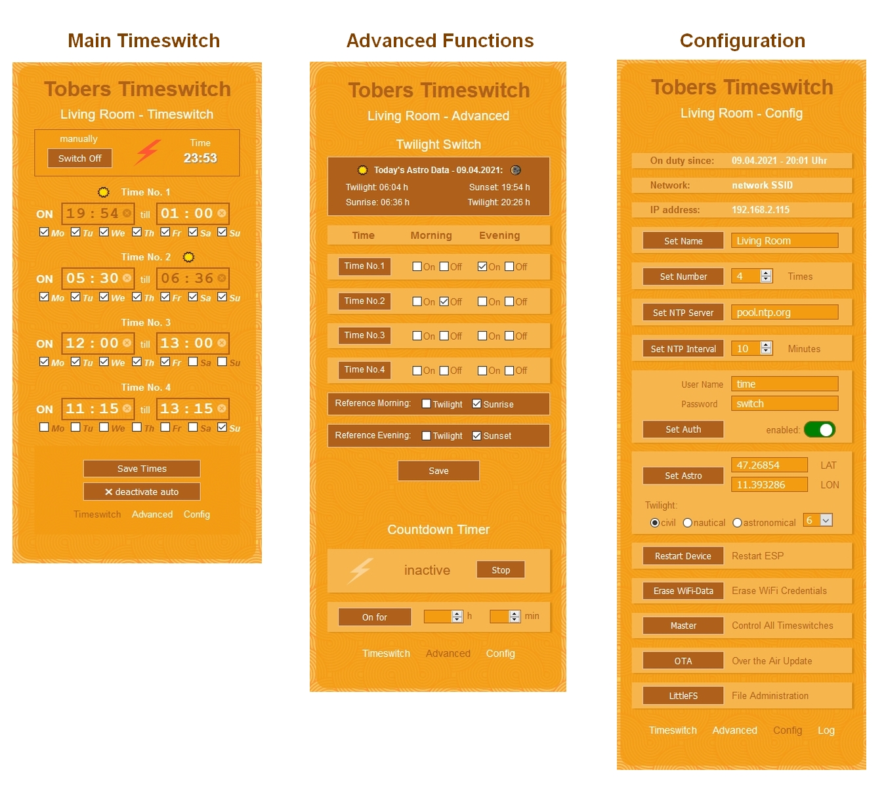
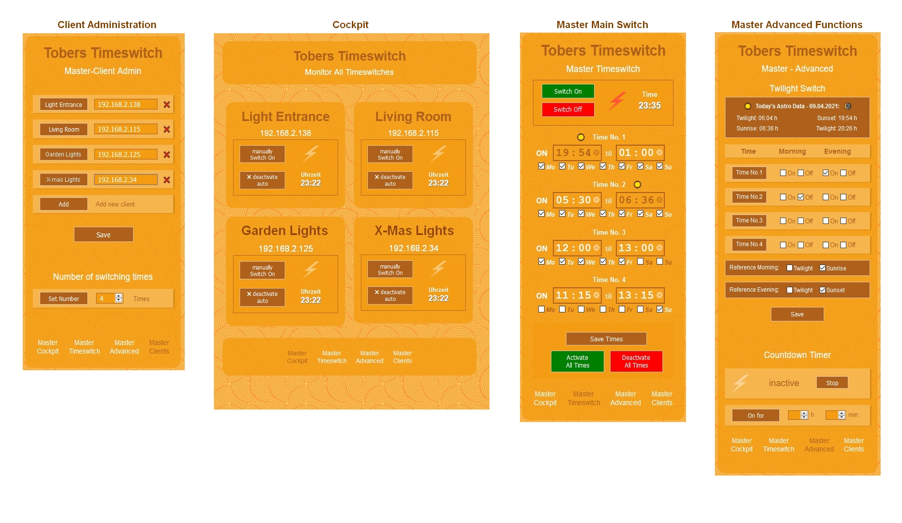

# Tobers Timeswitch for ESP8266
Tobers Timeswitch is a versatile and multifunctional timeswitch for ESP8266 devices, based on the great timeswitches on www.fipsok.de (Jens Fleischer).

Beside the "classical" timeswitch functions widely configurable for every single day, it offers a lot of different sunrise/sunset and twilight modes. A countdown timer is also available. 
Using the inbuilt Master/Client function you can program multiple devices "by one click". This can be very helpful if you have lot of devices running that shall all use the same scheme of switching times.
Tobers Timeswitch is easily and extensively configurable via a comfortable web interface. 
 

## Webinterface and Functions
  

**Main Timeswitch** 
* set switching times and active days
* enable/disable single times or activate/deactivate all switching times
* times coloured brown below a sun symbol can't be changed manually because they have been assigned to the twilight functions 
 

**Advanced Functions** 
* assign twilight or sunrise/sunset times to certain switching times
* choose between sunrise/sunset or twilight as reference for switching times
  (twilight type can be set via config site) 
* enable/disable countdown timer 
(while countdown timer is active all switching times are deactivated) 
 

**Configuration** 
* set name of time switch
* set number of switching times
* set NTP server
* set interval for NTP server call
* enable/disable authentication for html sites and set credentials
* set longitude/latitude of your location and configure twilight type
* restart device
* erase WiFi data
* access to Master Function controlling multiple time switches
* access to Over the Air Update (OTA) via web interface
* access to file administration
* acces to Log-Site logging latest ten NTP-Server-Calls 
  

## Master Functions
 
**Client Administration** 
* add or delete IP adresses of clients  
* IP adress of master device mist also be added
* list of clients is sent to all clients 
  -> master functions can also be called on client devices 
* set number of switching times for master and all client devices 
 

**Cockpit** 
* overview of all clients to check connection and state
* switch on/off certain devices
* activate/deactivate all switching times of certain devives
* visit certain devices by clicking the IP adress 
 

**Master Main Switch and Master Advanced Functions** 
* Configuration of switching times and advanced settings for **all devices** 
 

**For complete and detailed information about the setup of the device and the steps to be taken before compiling please visit the article I wrote at hackster.io. You will also find some more pictures and a video there.**
  

## Requirements
* *Hardware* 
ESP8266 or ESP8266 based device with at least 1MB flash memory  

* *Arduino IDE and the following libraries:* 
[My fork of WifiManager library (development branch) by tzapu/tablatronix](https://github.com/ElToberino/WiFiManager_for_Multidisplay) 

* *Installed boards:* 
[ESP8266 core for Arduino](https://github.com/esp8266/Arduino) 

* *Recommended tools:* 
[Arduino ESP8266 LittleFS Filesystem Uploader](https://github.com/earlephilhower/arduino-esp8266littlefs-plugin) 
 

## Important Notes 
This code has been made for ESP8266. There is a large number of smart devices availabe basing on these chips - some of them are easily flashable with a custom firmware. Many tips and tutorials can be found in the web explainig how this flashing process can be made. I don't give any advise concerning this because it can be (potentially) very dangerous: Most of these devices are working with mains voltage - so modifying these devices can become a life threatening thing, if you don't have the expertise for electrical works!
As clearly stated in the license *the code is published "without any warranty; without even the implied warranty of merchantability or fitness for a particular purpose."* 
 
**General information about smart devices, smart plugs etc.** 
A lot of smart devices are used for switching loads on and off. It is very important (!) to keep within the specifications of the device and not to exceed the maximum load declared on the devices. (Of course, this should be self-evident and a matter of common sense (or as we say: "Hausverstand"). Having read through a lot of forums and hearing complaints about melt-down or burnt-off devices that people have used to switch large boilers etc., I feel myself forced to give this hint).
I myself wouldn't even think about reaching the maximum load - high loads should always be switched by *contactors* (German: "*Schütz*"). 
 
Loads including a *"Switching Power Supply"* (most of the modern devices and gadgets have inbuilt SWPs) can also cause problems, because - in the moment of switching on - many SWPs can pull very high inrush currents, exceeding the maxium rated load of the device by multiple times. Of course, only for a short time of some ms, but the resulting arc between the switching contacts of the relay can weld them together and destroy your switching device. This can be prevented by using *contactors* or *inrush current limiters*.
Many people are not aware, that even a couple of simlutaniously switched on "retrofit LED bulbs" can cause this damage, though the rated current of these lamps is very low. But each of these has a small built-in SWP and, in total, this can be too much load for the relay contacts. You can often read complaints like "My smart device has been damaged after some weeks and can't be switched off any more" - but mostly this isn't a failure of the smart device but of the wrong or not properly calculated load attached to it.  
 

## Credits
This project wouldn't have been possible without the work of many others:
* Special thanks to Jens Fleischer - the time switches presented on his site are the nucleus around which I built my own version of a time switch. 
His fantastic website www.fipsok.de is one of the best places in the web to find inspiration and help concerning ESP8266 and ESP32 projects. Furthermore, the projects on his site enabled me to learn a lot about Javascript functions, which are an essential part of this project.
* HTML background pattern graphic by Henry Daubrez, taken from http://thepatternlibrary.com/
* Thanks to the many, many other programmers and enthusiasts in the web whose work and helpfulness enabled me to realize such a project.
